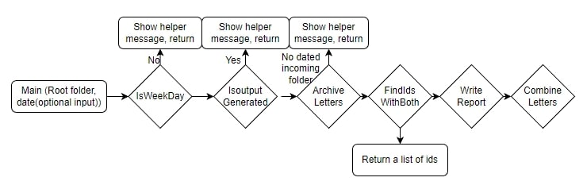

# LetterMerge
**Introduction**  
- This Console App is designed to 1) archive admission and scholarship letters which will be sent to students and then 2) combine two letters if one student has received both. The letters come into the input folders daily on weekdays. The goal of this Console app is to save mailing fees by combining admission and scholarship letters of a student into one envelop and to organize the letters by archiving them.      
  
    
**Features**
1. Check if the user is running the program at a workday; if it is run on a weekend, the user will be notofied to run it after 10a.m. on a workday; 
2. Tell the user if the program has already been run and if the files has already been generated;
3. Archive the files from the Input folders to the Archive folders;
4. Combine the admission and scholarship letters of students who have both letters on the same day;
5. Generate a txt report in the same dated folder as the letters combined. The report contains the processing date, the total number of combined letters, and their corresponding University IDs.
  
**Requirements**
- .NET 7 framework in C#.  
  
**Usage**
- Download the repository and extract the repository.
- Open the LetterMerge.sln file, and use the Solution Explorer to open the entire repository.
- In visual studio, click on the debug tab select "LetterMerge debug properties".
- Set: 1) commandline arguments to be "Root 20230206" (no need to type the quotation marks) & 2) working directory to be the LetterMerge subfolder under the LetterProcessing-master folder. So if the downloaded and extracted path is on a Desktop, the whole path looks something like "C:\Users\<user name>\Desktop\LetterProcessing-master\LetterMerge"
- Run the program. 
- Expected results: Under the "Root" folder in the LetterMerge project, the report and combined letters will be generated in the newly-created "20230206" subfolder of the Output folder, and the letters will be archived in the created "20230206" subfolders of the "Admission" and "Scholarship" subfolders of the Archive folder.
- To run the testing, select the Test tab, open Test Explorer, and run all tests.

**Testing**  
In the TestProject Folder, there is a NUnit testing enviroment, and seven unit testing components are included:
  -  Test the IsWeekday method in case the user is running on a weekend
  -  Test the IsOutPutGenerated method in case the user has already run the program on that day
  -  Test the ArchiveLetters method when there are letters to move for the day
  -  Test the ArchiveLetters method when there are no letters to move for the day
  -  Test the FindIdsWithBoth method to see if it can fetch ids that have two letters
  -  Test the WriteReport method to see if a report is generated in the correct place, with the right content
  -  And test the CombineTwoLetter method to determine if a report is generated in the correct place, with the right content
  -  After all testing are done, all the testing file folders are deleted by a TearDown.  
    
**Design**  
  
- The program takes two arguments: the root folder name and an optional date string in the format of "yyyyMMdd". If the date string is not provided, the program considers the date is today. The program then performs several actions, including two initial checks (check if the date is a weekday and check if the output has already been generated), archiving, finding students with two letters, generating a report, and combining letters, all of which can be evoked by calling instances of the InitialCheck class and the LetterSerive class.
  - The InitialCheck class is responsible for
    - check if the user is running on the program on a weekend; and if not, 
    - if the program has already been run 
  - The LetterSerive class os responsible for:
    - The ArchiveLetters method of the LetterService class is responsible for performing various actions related to letter processing, such as archiving letters, finding students with two letters, writing a report, and combining letters.
    - The doubleStudents method is for finding students of both letters; it returns a list of the students' ids.
    - The WriteReport method creates the dated subfolder, and writes the report and put it into the dated subfolder of the Output folder
    - The CombineTwoLetters method combines the two letters of the same student and put it into the dated subfolder of the Output folder
- The code follows a modular design, where different functions are separated into their own classes for better readability and maintainability.

**Assumptions and vulnerability**
- The program does not handle any exceptions caused by a potential mistake coming from the source of the incoming files. To be more precise:
  - It assumes that on each workday, there is a possibly of files incoming and does not distinguish between a workday and a holiday
  - Moreoever, if there are no folders on a workday at 10am, the program assumes that there are no letters to process.
    - *** Therefore, if there were to be some network delays of the incoming input folders, the user could have run the program, and, having found that no folders exist, conclude that there were no files to process.
- The program assumes that under the Archive folder, following the structure of the Input folder, two subfolders named "Admission" and "Scholarship" are already created.
  - ** So if a user wishes to archive all files in a single dated folder, the program does not provide such flexibility. 
- No time-difference-related problems are considered.
  - ** If a user is using the program in a different region and using their own timezone as a reference to the "10am workday" rule, some misunderstanding can happen.

**Planning for the project and actual time used**
- Understanding and planning the requirements of the program -- 2 hour planned/2 hour used
  - The planning phase was used to design the general structure of the code and determine which classes/methods need to be implemented as a baseline
- Implement the main method along with the overall structure of the other clases -- 1 hour planned/1.5 hours used
  - The implementation took longer than initially expected, because I initially used 
    - A static root for the input/output/archive filefolders
    - take in the date string using the DateTime.Today.ToString()
- Implement InitialCheck Class to validate the date and the output directory -- 1.5 hour planned/1 hour used
- Implement the LetterSerivice Class -- 2 hours planned/2 hours used
- Writing Nunit tests and debugging -- 1.5 hours planned/2 hours used
  - During the debugging phase, I decided that I needed to split the functionality of the two outputs, i.e., generating a report and writing the comebineTwoLetters method. It would be more modular, and since the format of CombineTwoLetter was orginally provided, changing it would mean that I need to communicate my change (which provides no other functionality) to the other members of my team.
- Comments & Documentation -- 2.5 hours planned/2.5 hours used
  
**Future improvements & implementations**
- If the previous workday (or even several days before that) the program is not executed
  - We can create a cache txt document to tract the dates on which the program has been run. Then we can ask the user to check the cache.txt to find which days are missing, and manually excute the runs 
  - Or we can write a method, CheckPreviousRun, within the InitialCheck class; (for instance, if a user has run the program on Monday "20230206" but not on the previous workday "20230203", such a notification telling them that they should run the program -- with date parameter set as the previous workday -- could be helpful)
    - The CheckPreviousRun can have such a structure:  
    string CheckPreviousRun(string date)  
    {  
      previousDate = FindPreviousWorkDay(date)  
      (if ((inputAdmissionDir for previousDate exists) or (inputScholarshipDir for previousDate exists)) and (outputDir for previousDate do not exist))  
      print("WARNING: please run the program for the previous {previousDate}")  
      return previousDate  
    }  
    - Here the FindPreviousWorkDay should be a helper method to determine the previous workday given any workday. With another two unit tests, this approach will become an option.
  - As another choice, we can use automatic runs using some kind of shell-script to run the program once per day.
- More robust testing. That can include:
  - Integration testing. The basic run only provides one instance of such a run, and other runs can include:
    - a run that does not set a date (then by default, date string will be converted to today)
    - if the aforementioned CheckPreviousRun method is implemented, a run can include a date that has emails to process and a previous workday run missed.
  - More edge cases/outliers testing
- Assuming there are some errors with regard to the incoming files, the LetterService class can add functions such as
  - Detect if the admission folder has some scholarship letters (it would not be cost-effective to do so, but it can reduce some confusion for the student receive an email stating that he has an admission -- info based on the admission folder -- while receiving a scholarship letter);
  - Detect if the same letter has been put in both the Admission and the Scholarship folder. If that is the case, it (depending on how the system is organized) could mean that the same letter will be mailed twice;
- The report can include more statistics such as the number of the admission/scholarship letters for the day.
- The modular implement does not take in the fact that the number of letters processed each day does not cause a complexity issue. Assume we are dealing with millions  of some incoming files, it might be more beneficial to extract as much information as possible during one single run. (For instance, in that case, during the archive phase, we can extra the id: lettercategory key-value pair, and other statistical information on-the-fly.)

**Conclusion**  
This Console App for Processing Admission and Scholarship Letters will save mailing fees by combining admission and scholarship letters of students into one envelop. The app also generates a text report containing the processing date, total number of combined letters, and corresponding University IDs.
